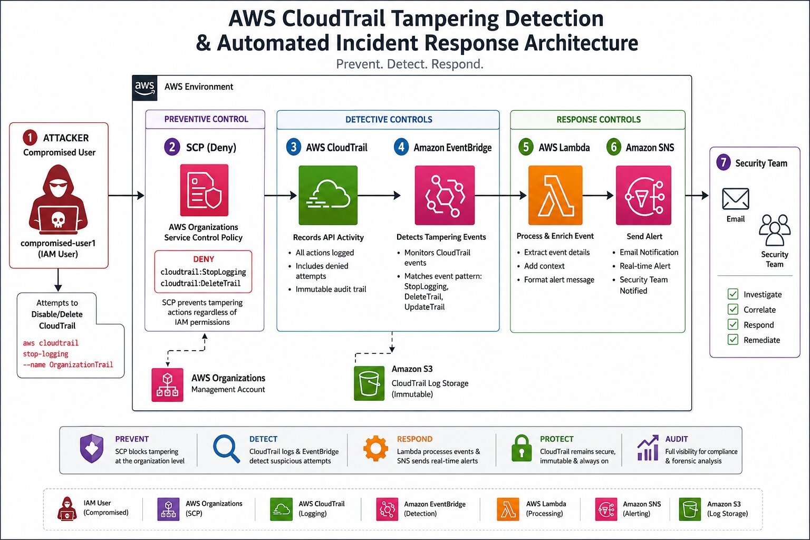

## Project Overview
# AWS Detection Engineering Project: CloudTrail Tampering Detection & Automated Incident Response

## Overview

This project demonstrates how to detect and respond to CloudTrail tampering attempts in a multi-account AWS environment.

The solution combines preventive controls (Service Control Policies) with detective controls (CloudTrail, EventBridge, Lambda, and SNS) to identify malicious attempts to disable or delete CloudTrail logging.

### Security Objective

Detect and alert on the following actions:

* cloudtrail:StopLogging
* cloudtrail:DeleteTrail
* cloudtrail:UpdateTrail

The architecture simulates a compromised IAM user attempting to disable audit logging while security controls prevent the action and generate real-time alerts.

---

## Architecture

Compromised User
↓
CloudTrail Tampering Attempt
↓
Service Control Policy (Deny)
↓
CloudTrail Records Event
↓
EventBridge Detects Event
↓
Lambda Processes Event
↓
SNS Sends Alert
↓
Security Team Notified

---

## AWS Services Used

| Service                        | Purpose                          |
| ------------------------------ | -------------------------------- |
| AWS Organizations              | Multi-account governance         |
| Service Control Policies (SCP) | Prevent CloudTrail tampering     |
| AWS CloudTrail                 | Record API activity              |
| Amazon EventBridge             | Detect tampering events          |
| AWS Lambda                     | Process and enrich events        |
| Amazon SNS                     | Send notifications               |
| IAM                            | Simulate compromised credentials |

---

## Project Components

### Preventive Controls

* SCP denies StopLogging
* SCP denies DeleteTrail
* SCP overrides IAM permissions

## Detective Controls

* CloudTrail captures API activity
* EventBridge matches tampering events
* Lambda enriches findings
* SNS distributes alerts

### Response Controls

* Real-time email notification
* Security team visibility
* Audit trail preservation

---

## Attack Simulation

User:

compromised-user1

Attempts:

aws cloudtrail stop-logging --name OrganizationTrail

Expected Result:

AccessDeniedException

Detection Pipeline:

CloudTrail → EventBridge → Lambda → SNS

---

## Learning Outcomes

After completing this project you will understand:

* AWS Organizations
* Service Control Policies
* CloudTrail internals
* EventBridge event patterns
* Lambda security automation
* SNS alerting
* Detection engineering concepts
* Cloud security monitoring
* Incident response automation

---

## Future Enhancements

* Security Hub integration
* GuardDuty integration
* Slack notifications
* Microsoft Teams notifications
* Automated remediation
* Step Functions workflow
* SOAR integration
* Cross-account event aggregation

---

## Skills Demonstrated

* AWS Security Engineering
* Cloud Detection Engineering
* Security Monitoring
* Incident Response
* IAM Governance
* Security Automation
* Cloud Architecture
* Event-Driven Design

# Author

Kalyan Jalli

Cloud DevOps & Security  Engineer Building real-world AWS DevOps, Security and automation projects.

License

This project is for educational purposes.

