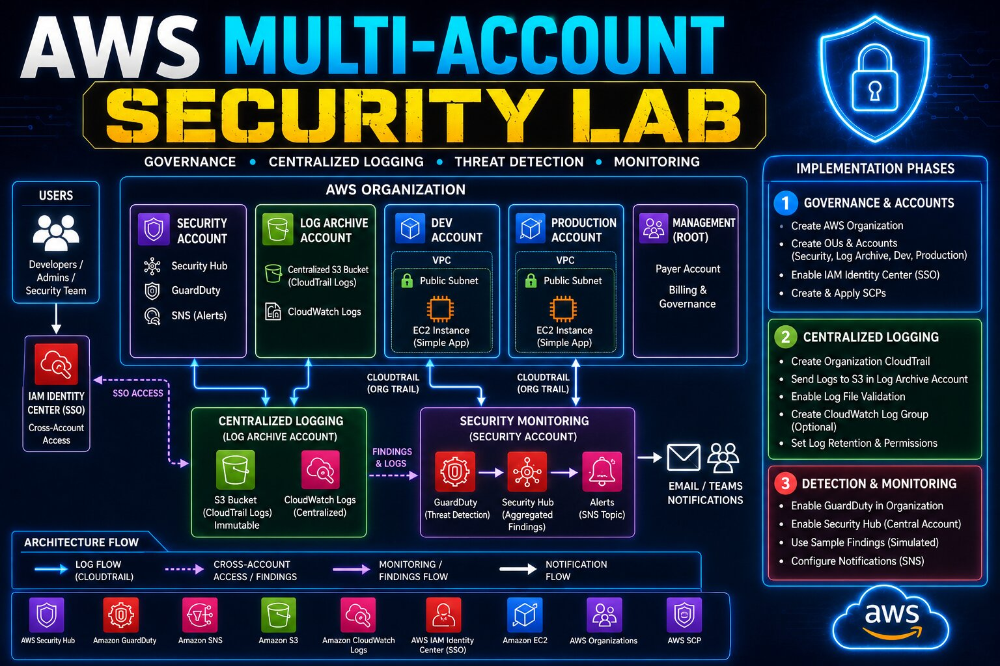

# AWS Multi-Account Security Lab

## Project Overview

This project demonstrates how to build a secure multi-account AWS environment following enterprise cloud security best practices.

The lab focuses on:

* AWS Organizations
* IAM Identity Center (SSO)
* Service Control Policies (SCPs)
* Centralized CloudTrail Logging
* Log Archive Account
* AWS GuardDuty
* AWS Security Hub
* Multi-Account Governance
* Threat Detection & Monitoring

The architecture follows a typical enterprise landing-zone model with separate accounts for governance, security operations, logging, and workloads.

---

## Architecture Diagram




## AWS Accounts

| Account             | Purpose                                                  |
| ------------------- | -------------------------------------------------------- |
| Management Account  | Billing, governance and AWS Organizations management     |
| Security Account    | Centralized security monitoring and findings aggregation |
| Log Archive Account | Centralized immutable audit log storage                  |
| Dev Account         | Development workloads                                    |
| Production Account  | Production workloads                                     |

---

# AWS Services Used

| Service                         | Purpose                                      |
| ------------------------------- | -------------------------------------------- |
| AWS Organizations               | Multi-account governance                     |
| IAM Identity Center (SSO)       | Centralized authentication and authorization |
| Service Control Policies (SCPs) | Preventive security guardrails               |
| AWS CloudTrail                  | Organization-wide audit logging              |
| Amazon S3                       | Centralized CloudTrail log storage           |
| Amazon GuardDuty                | Threat detection                             |
| AWS Security Hub                | Aggregated security findings                 |

---

# Final Architecture

## Phase 1 – Governance & Accounts

### Objectives

* Create AWS Organization
* Create Organizational Units (OUs)
* Create AWS Accounts
* Configure IAM Identity Center
* Configure Permission Sets
* Configure SCP Guardrails

### Organizational Structure

```text
AWS Organization
│
├── Security OU
│   └── Security Account
│
├── Log Archive OU
│   └── Log Archive Account
│
└── Workloads OU
    ├── Dev Account
    └── Production Account
```

### Key Deliverables

* Centralized governance
* Cross-account authentication
* SCP-based security controls
* Enterprise account structure

---

# Phase 2 – Centralized Logging

## Objectives

* Configure Organization CloudTrail
* Create centralized S3 logging bucket
* Enable centralized CloudWatch logging

## Logging Architecture

```text
Dev Account
       │
       ▼
Production Account
       │
       ▼
Organization CloudTrail
       │
       ▼
Log Archive Account
       │
       ▼
S3 Bucket (Immutable Logs)
```

## Why Centralized Logging?

### Security Benefits

* Prevent attackers from deleting logs
* Centralized forensic investigations
* Compliance reporting
* Threat hunting
* Audit evidence retention

### Enterprise Benefits

* Single source of truth
* Easier incident response
* Separation of duties
* Reduced operational complexity

---

# Phase 3 – Threat Detection & Monitoring

## Objectives

* Enable GuardDuty Organization-Wide
* Enable Security Hub Aggregation
* Configure SNS Notifications
* Review Sample Findings

## Monitoring Architecture

```text
CloudTrail Logs
        │
        ▼
GuardDuty
        │
        ▼
Security Hub
        │
        ▼
SNS Alerts
```

## Security Services

### GuardDuty

Provides:

* Threat intelligence detection
* IAM compromise detection
* Reconnaissance detection
* Malware indicators
* Suspicious activity detection

### Security Hub

Provides:

* Centralized findings dashboard
* Aggregated security findings
* Cross-account visibility
* Compliance overview

---

---

# Learning Outcomes

After completing this project, you will understand:

* AWS Organizations
* Organizational Units (OUs)
* IAM Identity Center (SSO)
* Permission Sets
* Service Control Policies
* Organization CloudTrail
* Centralized Logging
* GuardDuty
* Security Hub
* SNS Notifications
* Enterprise AWS Security Architecture

---

# Future Enhancements

Potential next steps:

* AWS Config
* EventBridge Security Automation
* Lambda Auto-Remediation
* Security Lake
* OpenSearch SIEM Integration
* Cross-Account EventBridge Architecture
* Automated Incident Response

---
## Author

**Kalyan Jalli**

Cloud & DevOps Engineer
Building real-world AWS architecture, Security and automation projects.

License

This project is for educational purposes.

