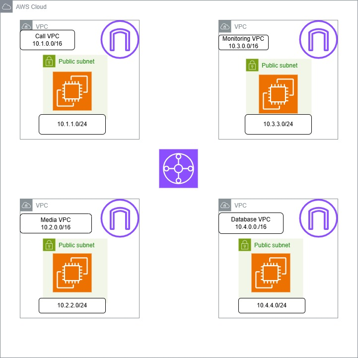

# AWS Transit Gateway Demo Lab

## Architecture Diagram

##  Project Overview

This project demonstrates how to design and implement a **hub-and-spoke network architecture using AWS Transit Gateway**.

We will create multiple VPCs representing different application tiers and connect them using a Transit Gateway for **centralized routing, scalability, and network segmentation**.

### VPCs Created

| VPC Name       | CIDR        |
| -------------- | ----------- |
| Call-VPC       | 10.1.0.0/16 |
| Media-VPC      | 10.2.0.0/16 |
| Monitoring-VPC | 10.3.0.0/16 |
| Database-VPC   | 10.4.0.0/16 |

---

## Internet Gateway Configuration

Each VPC is attached to its own Internet Gateway:

* Call-VPC-IG
* Media-VPC-IG
* Monitoring-VPC-IG
* Database-VPC-IG

##  Subnet Design

| VPC            | Subnet Name          | CIDR        |
| -------------- | -------------------- | ----------- |
| Call-VPC       | Call-Server-01       | 10.1.1.0/24 |
| Media-VPC      | Media-Server-01      | 10.2.2.0/24 |
| Monitoring-VPC | Monitoring-Server-01 | 10.3.3.0/24 |
| Database-VPC   | Database-Server-01   | 10.4.4.0/24 |

---

##  Route Table Configuration

Each VPC has its own route table:

| Route Table       | Associated Subnet    |
| ----------------- | -------------------- |
| Call-VPC-RT       | Call-Server-01       |
| Media-VPC-RT      | Media-Server-01      |
| Monitoring-VPC-RT | Monitoring-Server-01 |
| Database-VPC-RT   | Database-Server-01   |

---

##  Security Groups

Security groups are created per VPC to control traffic:

* Call-VPC-SG
* Media-VPC-SG
* Monitoring-VPC-SG
* Database-VPC-SG

---

##  Transit Gateway Setup

### Steps:

1. Create Transit Gateway
2. Attach all 4 VPCs to Transit Gateway
3. Select appropriate subnets for attachment
4. Enable route propagation (optional for dynamic routing)

---

---

##  Testing

### Suggested Tests

* Ping between VPCs

## Author

**Kalyan Jalli**

Cloud & DevOps Engineer  
Building real-world AWS architecture and automation projects.

GitHub: https://github.com/cloudopsjalli

License

This project is for educational purposes.

