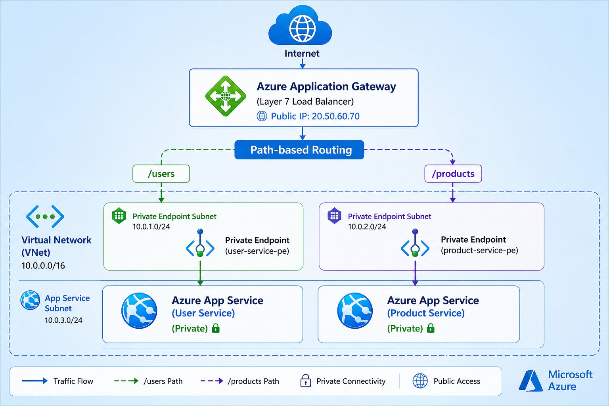

#  Azure Microservices Architecture with Application Gateway (Secure PaaS Design)

---

## Project Overview

This project demonstrates a **production-style microservices architecture on Microsoft Azure** using fully managed services (PaaS).

It showcases how to securely expose multiple backend services through a **centralized Layer 7 entry point (Application Gateway)** with **private backend connectivity


## Architecture Diagram




```
Internet
   ↓
Application Gateway (Public IP)
   ↓
Path-Based Routing
   ├── /users     → User Service
   └── /products  → Product Service
   ↓
Private Endpoints (VNet)
   ↓
Azure App Services (Private Only)
```

---

###  Subnets

| Subnet Name     | CIDR        | Purpose                                  |
| --------------- | ----------- | ---------------------------------------- |
| frontend-subnet | 10.0.1.0/24 | Reserved (future frontend/ingress layer) |
| backend-subnet  | 10.0.2.0/24 | Private Endpoints for App Services       |
| db-subnet       | 10.0.3.0/24 | Reserved for database layer              |
| appgw-subnet    | 10.0.4.0/24 | **Dedicated for Application Gateway**    |

---

##  Azure Services Used

* Azure App Service (PaaS)
* Application Gateway (Standard v2 - Layer 7 Load Balancer)
* Virtual Network (VNet)
* Private Endpoints
* Network Security Groups (NSG)

---

##  Traffic Flow

###  User Service Flow


Internet
  → Application Gateway (Public IP)
  → Path-based Routing (/users)
  → Private Endpoint (backend subnet)
  → Azure App Service (User Service - Private)
```

---

### Product Service Flow

```
Internet
  → Application Gateway (Public IP)
  → Path-based Routing (/products)
  → Private Endpoint (backend subnet)
  → Azure App Service (Product Service - Private)
```

---

##  Security Architecture

*  No direct public access to backend services
*  All traffic routed via Application Gateway
*  Private Endpoints used for backend connectivity
*  Host header validation enforced
*  Layered subnet separation

---

##  Key Concepts Implemented

* Path-based routing using Application Gateway
* Backend pools and routing rules
* Health probes and backend monitoring
* Host header override (critical for App Service)
* Private Endpoint for secure PaaS access
* Subnet isolation for layered architecture

---

##  AWS Equivalent Architecture

| Azure               | AWS                             |
| ------------------- | ------------------------------- |
| Application Gateway | Application Load Balancer (ALB) |
| App Service         | Elastic Beanstalk / ECS         |
| Private Endpoint    | PrivateLink                     |
| VNet                | VPC                             |

---


##  Future Enhancements

* 🔹 Add Azure SQL / Cosmos DB
* 🔹 Enable HTTPS with SSL certificates
* 🔹 Add Web Application Firewall (WAF)
* 🔹 Integrate Application Insights (monitoring)
* 🔹 Containerize services (Docker)
* 🔹 Deploy to Azure Kubernetes Service (AKS)


##  Author

Kalyan Jalli

Azure| AWS | Networking | DevOps


## This project is for educational purpose only.
