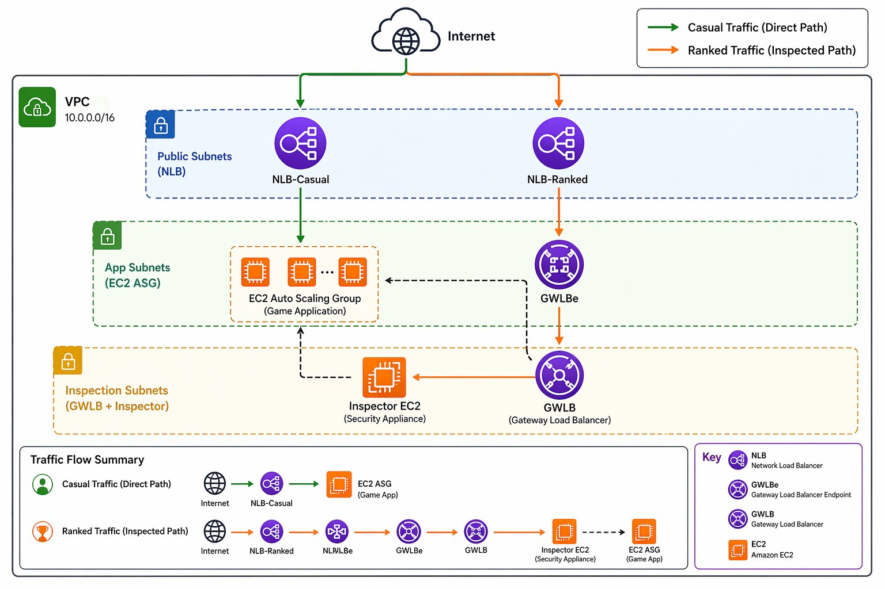

# GameZone – Secure AWS Traffic Architecture (NLB + GWLB)

## Project Overview

GameZone is a production-style AWS networking architecture that demonstrates traffic segmentation and inline security inspection** using:

* Network Load Balancer (NLB)
* Gateway Load Balancer (GWLB)
* Auto Scaling Group (ASG)
* VPC routing and subnet design

This project simulates a gaming platform where:

*  Casual traffic flows directly to backend servers
*  Ranked traffic is inspected through a security layer before reaching the application

## Architecture Diagram




###  Casual Traffic (Direct Path)

```
Internet → NLB-Casual → EC2 (Flask App - ASG)
```

###  Ranked Traffic (Inspected Path)

```
Internet → NLB-Ranked → GWLBe → GWLB → Inspector EC2 → EC2 (Flask App - ASG)
```

---

##  AWS Components Used

| Component          | Purpose                         |
| ------------------ | ------------------------------- |
| VPC                | Network isolation (10.0.0.0/16) |
| Public Subnets     | Host NLBs                       |
| App Subnets        | Host EC2 ASG                    |
| Inspection Subnets | Host GWLB and Inspector         |
| NLB                | Entry point for traffic         |
| GWLB               | Inline traffic inspection       |
| GWLBe              | Traffic redirection             |
| EC2 (Inspector)    | Simulated security appliance    |
| EC2 (ASG)          | Flask gaming application        |

---

##  Key Features

* ✔ Dual traffic path (direct vs inspected)
* ✔ Inline inspection using GENEVE (UDP 6081)
* ✔ Scalable backend using Auto Scaling Group
* ✔ Clean subnet separation (Public / App / Inspection)
* ✔ Real packet validation using tcpdump

---

##  Traffic Flow Explained

###  Casual Users

* Traffic goes directly from NLB to application
* Low latency, no inspection

###  Ranked Users

* Traffic is routed via GWLB
* Inspector EC2 captures and analyzes packets
* Simulates firewall / IDS behavior

---

##  Validation Steps

SSH into Inspector EC2:

```bash
sudo tcpdump -i any udp port 6081
```

You should see:

* GENEVE encapsulated packets
* SYN packets from clients

---

## Deployment Steps (High-Level)

1. Create VPC with CIDR 10.0.0.0/16
2. Create:

   * Public Subnets (NLB)
   * App Subnets (EC2 ASG)
   * Inspection Subnets (GWLB)
3. Deploy Flask app on EC2 (ASG)
4. Create NLB (Casual & Ranked)
5. Create GWLB + Target Group (GENEVE 6081)
6. Launch Inspector EC2
7. Create GWLB Endpoint (GWLBe)
8. Update route tables for inspection path

---

## 🔐 Security Considerations

* No direct internet access to app subnets
* Traffic inspection enforced via routing
* Security groups restrict unnecessary access
* Inspector acts as inline security layer

--

## 📈 Future Enhancements

* Integrate AWS WAF
* Replace Inspector with real firewall (Palo Alto / Fortinet)
* Add CloudWatch logs + alerts
* Infrastructure as Code (Terraform)
  Add HTTPS termination

##  Author

Kalyan Jalli

Azure| AWS | Networking | DevOps

