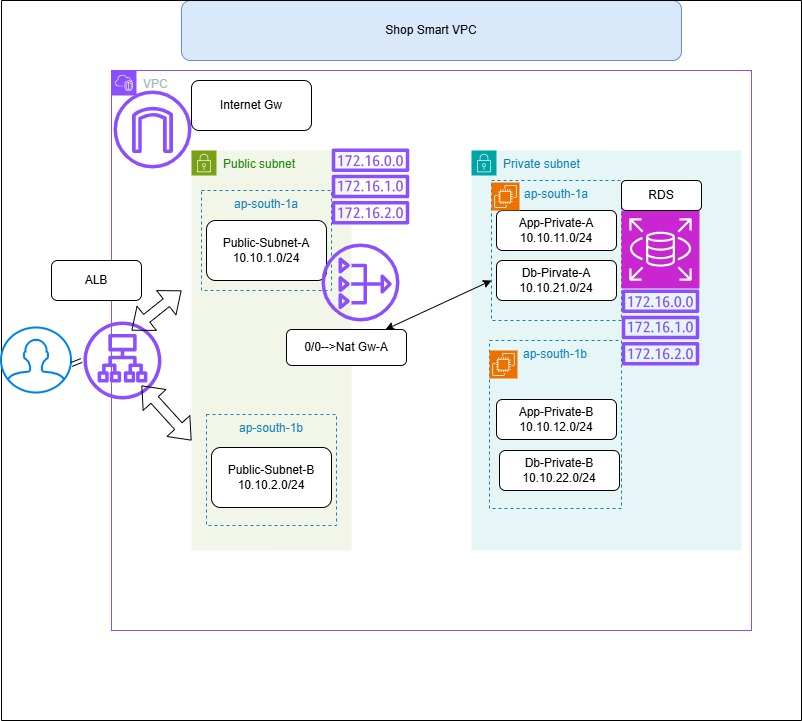

# ShopSmart – Production-Grade E-Commerce Architecture on AWS

## Project Overview

ShopSmart is a production-style e-commerce architecture built on AWS. This project demonstrates how real-world applications are designed for scalability, security, and high availability

## Architecture Components





### Compute

* Amazon EC2 (Application Servers)


### Networking

* Amazon VPC
* Public and Private Subnets
* Internet Gateway (IGW)
* NAT Gateway
* Application Load Balancer (ALB)

### Database

* Amazon RDS (MySQL)

---

## VPC Design

### VPC

* CIDR: `10.10.0.0/16`
* Name: `shopping-cart-demo`

### Subnets

| Type    | Name            | AZ          | CIDR          |
| ------- | --------------- | ----------- | ------------- |
| Public  | Public-Subnet-A | ap-south-1a | 10.10.1.0/24  |
| Public  | Public-Subnet-B | ap-south-1b | 10.10.2.0/24  |
| Private | App-Private-A   | ap-south-1a | 10.10.11.0/24 |
| Private | App-Private-B   | ap-south-1b | 10.10.12.0/24 |
| Private | DB-Private-A    | ap-south-1a | 10.10.21.0/24 |
| Private | DB-Private-B    | ap-south-1b | 10.10.22.0/24 |
---

### 🔐 Security Groups

### 1. ALB Security Group (sg-alb)

* Inbound: HTTP (80) from `0.0.0.0/0`
* Outbound:  ALL to `sg-app-ec2`

### 2. App EC2 Security Group (sg-app-ec2)

* Inbound:

  * HTTP (80) from `sg-alb`
  * SSH (22) from `sg-bastion`
* Outbound:

  * All traffic (0.0.0.0/0)

### 3. RDS Security Group (sg-rds)

* Inbound:

  * MySQL (3306) from `sg-app-ec2`

### 4. Bastion Security Group (sg-bastion)

* Inbound:

  * SSH (22) from your IP
* Outbound:

  * Default (all traffic)

---

##  Traffic Flow

### User Traffic

Internet → ALB → EC2 App Servers → RDS

### Admin Access

Laptop → Bastion Host → Private EC2

---

##  Project Implementation Steps

1. Design architecture diagram
2. Create VPC and subnets
3. Configure IGW and NAT Gateway
4. Set up route tables
5. Create security groups
6. Launch Bastion Host (Public Subnet)
7. Launch EC2 App Servers (Private Subnet)
8. Configure Application Load Balancer
9. Create RDS database

---

##  Folder Structure

```
ShopSmart-AWS/
│
│
├── README.md
│
├── architecture
│   └── architecture-diagram.png
├── app
│   ├── shop.py
│   │
│   ├── create database.txt
│
├── scripts
│   ├── install_python.sh
│   │
├── infrastructure


---

## Key Learning Outcomes

* Designing production-grade AWS architecture
* Secure VPC and subnet design
* Real-world traffic flow understanding
* Bastion-based secure access
* Load balancing and scaling concepts

---
## Author

**Kalyan Jalli**

Cloud & DevOps Engineer
Building real-world AWS architecture and automation projects.

GitHub: https://github.com/cloudopsjalli

License

This project is for educational purposes.


