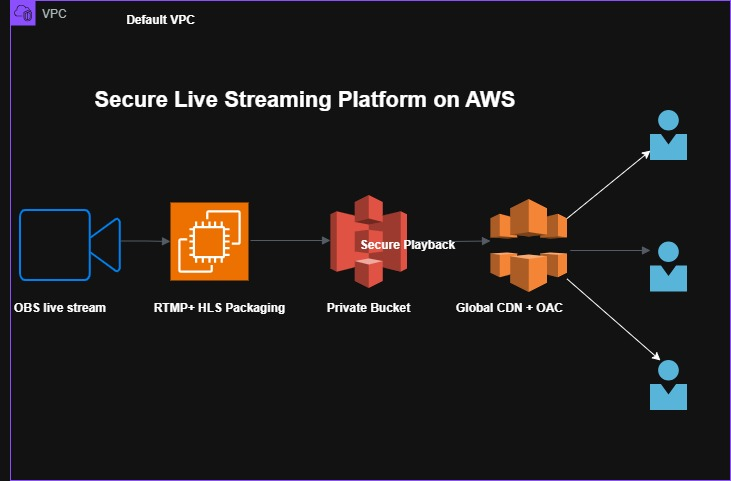

# Cloud-Based Global Streaming Platform on AWS

## Project Overview

This project demonstrates how to build a **production-style live video streaming platform** on AWS using industry-standard protocols and services.

It covers end-to-end streaming from ingestion to global delivery using **RTMP, HLS, Amazon S3, and CloudFront**.

---

## Architecture Diagram




## Architecture Overview


                   +------------------+
                   |      OBS         |
                   |  (Live Encoder)  |
                   +---------+--------+
                             |
                             | RTMP
                             v
                   +------------------+
                   |      EC2         |
                   |  NGINX + RTMP    |
                   |  HLS Packaging   |
                   +---------+--------+
                             |
                             | Upload HLS (.m3u8/.ts)
                             v
                   +------------------+
                   |      S3          |
                   |  Private Bucket  |
                   +---------+--------+
                             ^
                             | Signed Request (OAC)
                   +---------+--------+
                   |   CloudFront     |
                   |  CDN (Global)    |
                   +---------+--------+
                             |
                             | HTTPS
                             v
                        +----------+
                        | Viewer   |
                        | Browser  |
                        +----------+

## ️ Key Components

### 1. Ingestion Layer

* OBS (Open Broadcaster Software)
* Streams video using **RTMP protocol**

### 2. Processing Layer

* Amazon EC2 instance
* NGINX with RTMP module
* Converts RTMP stream → HLS format (.m3u8, .ts)

### 3. Storage Layer

* Amazon S3 (Private Bucket)
* Stores HLS segments
* Block public access enabled

### 4. Delivery Layer

* Amazon CloudFront (CDN)
* Origin Access Control (OAC)
* Secure global streaming via HTTPS

---

## Implementation Steps

### 1. Launch EC2 Instance

* Install NGINX with RTMP module
* Configure RTMP server
* Enable HLS output

### 2. Configure RTMP + HLS

* RTMP input from OBS
* HLS output directory setup
* Test local stream playback

### 3. Setup S3 Integration

* Create private S3 bucket
* Sync/upload HLS files from EC2
* Enable versioning (optional)

### 4. Fix 403 AccessDenied

* Ensure bucket is private
* Configure correct IAM permissions
* Use CloudFront OAC instead of public access

### 5. Configure CloudFront

* Create distribution
* Set S3 as origin
* Enable OAC (Origin Access Control)
* Allow only CloudFront to access S3

---

##  Security Best Practices

* Keep S3 bucket private
* Use OAC instead of public bucket policies
* Restrict EC2 security groups (RTMP, SSH)
* Use HTTPS via CloudFront


---

##  Folder Structure

```
aws-streaming-platform/
│
├── README.md
│
├── architecture/
│  │
├── ec2-nginx/
│   ├── nginx.conf
│   └── index.html
├── scripts/
│   ├── awscli.sh
│   └── install_nginx.sh
│
└── docs/
    ├── project.md


##  Key Learning Outcomes

* Live streaming protocols (RTMP, HLS)
* Media processing using NGINX
* Secure S3 architecture
* CloudFront CDN optimization
* Origin Access Control (OAC)

---

##  Testing Flow

1. Start stream from OBS
2. Verify RTMP ingestion on EC2
3. Check HLS files generation
4. Confirm upload to S3
5. Access stream via CloudFront URL

---

##  Use Cases

* Live events streaming
* Online education platforms
* Gaming streams
* Webinars and virtual conferences

---


## Author

**Kalyan Jalli**

Cloud & DevOps Engineer
Building real-world AWS architecture and automation projects.

GitHub: https://github.com/cloudopsjalli

License

This project is for educational purposes.


